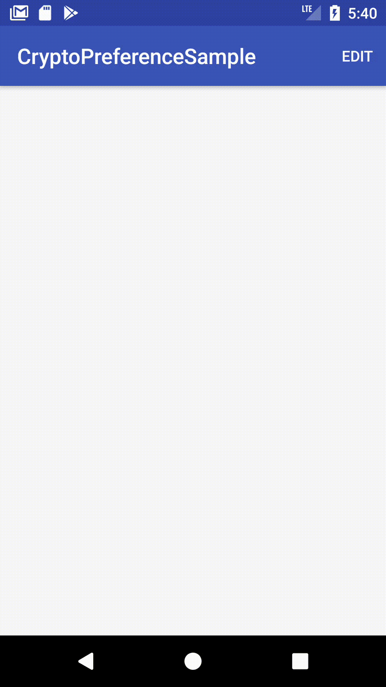
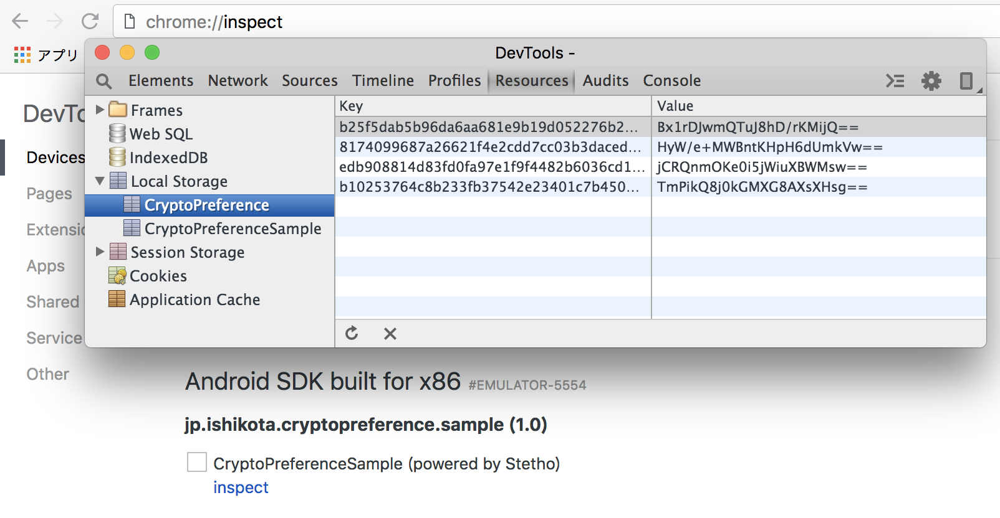

# CryptoPreference
[  ](https://bintray.com/ishikota/maven/cryptopreference/_latestVersion)

This library uses [AndroidKeystore](https://developer.android.com/training/articles/keystore) for secret key management if API level of running device is grater than 22(Lollipop).  
To support API level prior to 23(pre-Marshmallow), you need to manage secret key by yourself.

# How to use
First, set preference name. Maybe in your Application class.

```kotlin
class MyApplication: Application() {
    override fun onCreate() {
        super.onCreate()

        CryptoPreference.Initializer.apply {
            preferenceName = "PreferenceNameToSaveSecret"
            // If you need to support Lollipop, following line is needed.
            // Then This library uses this key for encryption and decryption.
            secretKeyForCompat = "0123456789123456".toByteArray()  // only 128 bit key length is supported now
        }
   }
}	
 ```

Next, create preference instance and save/get your secret value.
```kotlin
val pref = CryptoPreference.create(this, Algorithm.AES, BlockMode.CBC, Padding.PKCS7)
pref.savePrivateString("key_for_some_credential", "some credential")
pref.getPrivateString("key_for_some_credential", "default") // returns "some credential"
```

Then this library **obfuscates key** and **encrypts value** before save to SharedPreference.  
Here is the example of obfuscated key and encrypted value in preference.

| key | value |
|:--:|:--:|
| 4a60d853a75801ca7500d93e019c42786c0207517bb22e6439e6066c64b4228b | hz5FisUGqErXBq9CWmZzFw== |

# Download
```
dependencies {
    implementation 'com.github.ishikota:cryptopreference:0.1.0'
}
```

# Sample app


You can save key and value to preference via sample app.  
Then peek in preference with stetho. You can see obfuscated key and encrypted values.  

1. connect the device which runs sample app to your PC
2. open "chrome://inspect"
3. choose your device from 「Remote Target　list」 and click *inspect* for sample app(CryptoPreferenceSample)
4. move to 「Resources」 -> 「Local Storage」 -> 「CryptoPreference」


